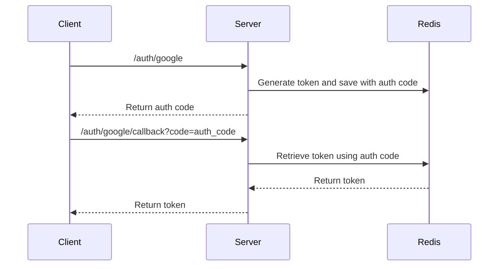

# Architecture Decision Record (ADR) - Kimlik Doğrulama ve Yetkilendirme

## Kimlik Doğrulama ve Yetkilendirme
### Strateji
- AuthZ ve AuthN için JWT kullanılacak.
- Hem kullanıcı girişi hem yeni kullanıcı kaydı için şifresiz bir kimlik doğrulama yöntemi kullanılacak.
- Sosyal medya giriş seçenekleri (Google, Facebook, vb.) için OAuth2 kullanılacak.
- Token kara listeleme için Redis kullanılarak JWT'ye ekstra bir katman eklenecek.

### Neden bu strateji?

JWT, kimlik doğrulama (authN) ve yetkilendirme (authZ) için neredeyse bir standarttır. Stateless (durumsuz) ve kullanımı kolaydır. Ancak, JWTlar invalid edilememelerinden ötürü güvenlik açığı oluşturmak veya ***her yerden çıkış yapmak** gibi bir durumu destekleyemezler. Bu sorunları aşmak için Redis kullanarak tokenları saklayabilir ve kullanıcı çıkış yaptığında veya token süresi dolduğunda kara listeye alınmalıdır. Bu şekilde, tokenları iptal etme yeteneği olan bir durumsuz kimlik doğrulama sistemi oluşturulur. İşte bu nedenle, kimlik doğrulama için JWT ve token yönetimi için Redis birlikte kullanılacaktır.

```js
async validate(payload: any) {
    // ...
    if (blockInfo) {
        const info = JSON.parse(blockInfo);
        throw new UnauthorizedException(`Token blocked (${info.reason})`);
    }
    // ...
}
```

- Şifresiz kimlik doğrulama, kullanıcı kimlik doğrulaması için modern bir yaklaşımdır ve güvenliği ve kullanıcı deneyimini artırır. Karmaşık şifreleri hatırlama ihtiyacını ortadan kaldırarak şifreyle ilgili güvenlik açıklarını azaltmakta.  Bu yüzden başlangıçta Google ile giriş yapmak tercih edilecektir. Kullanıcı Google ile giriş yaptığında, veritabanında bir kullanıcı oluşturulacak ve şifresiz kimlik doğrulama kullanılacaktır. Kullanıcı daha sonra şifre belirleyebilir ve şifreli kimlik doğrulama yapabilir.

```js
@Injectable()
export class GoogleStrategy extends PassportStrategy(Strategy, 'google') {
    constructor(private authService: AuthService) {
        super({
            // ...
        });
    }

    async validate(
        accessToken: string,
        refreshToken: string,
        profile: any,
        done: VerifyCallback,
    ): Promise<any> {
        const result = GoogleProfileSchema.safeParse(profile);
        if (!result.success) {
            return done(result.error, false);
        }
        const { id, emails } = result.data;
        const email = emails[0].value;
        const jwt = await this.authService.validateOrCreateUser(
            id,
            email,
            'google',
        );
        return done(null, {
            tokens: jwt,
        });
    }
}
```

Bu şekilde, kullanıcı Google ile giriş yapsa bile, veritabanımızda bir kullanıcı oluşturabilir ve geri kalan zaman için şifresiz kimlik doğrulama kullanabiliriz.

```js
async validateOrCreateUser(
    providerId: string,
    email: string,
    provider: string,
): Promise<{
    accessToken: string;
    refreshToken: string;
}> {
    let auth = await this.repository.findOne({
        where: { email, provider, providerId },
        relations: ['user'],
    });

    if (!auth) {
        const user = this.userRepository.create({
            username: email.split('@')[0],
        });

        await this.userRepository.save(user);

        auth = this.repository.create({
            email,
            provider,
            providerId,
            user,
        });

        await this.repository.save(auth);
    }
    const accessToken = this.jwtService.sign(
        {
            uid: auth.user.id,
            email: auth.email,
            username: auth.user.username,
            jti: randomUUID(),
        },
        {
            expiresIn: '10m',
        },
    );
    const refreshToken = this.jwtService.sign(
        {
            uid: auth.user.id,
            email: auth.email,
            username: auth.user.username,
            providerId: auth.providerId,
            provider: auth.provider,
            jti: randomUUID(),
        },
        {
            expiresIn: '7d',
        },
    );

    return { accessToken, refreshToken };
}
```
### Nasıl?

Web üzerinde bir geliştirme yapılıyor olsa idi elbette ***Set-Cookie*** cevabı ile eklenmiş bir ***HttpOnly*** çerezi ile kimlik doğrulama yapılabilirdi. Ancak mobil uygulama üzerinde çalıştığımız için bu yöntem geçerli değil. Mobil uygulama üzerinde OAuth2 girişlerinin genelinde bir query parametresi ile token dönülmekte olduğu için iş bu yönde ilerleyeceğiz. 
Ancak, bu durumda yine de refresh ve access tokenları açıkça query parametreleri ile döndürmek pek de rahat hissettiren bir yöntem olmayacaktır. Bu yüzden


