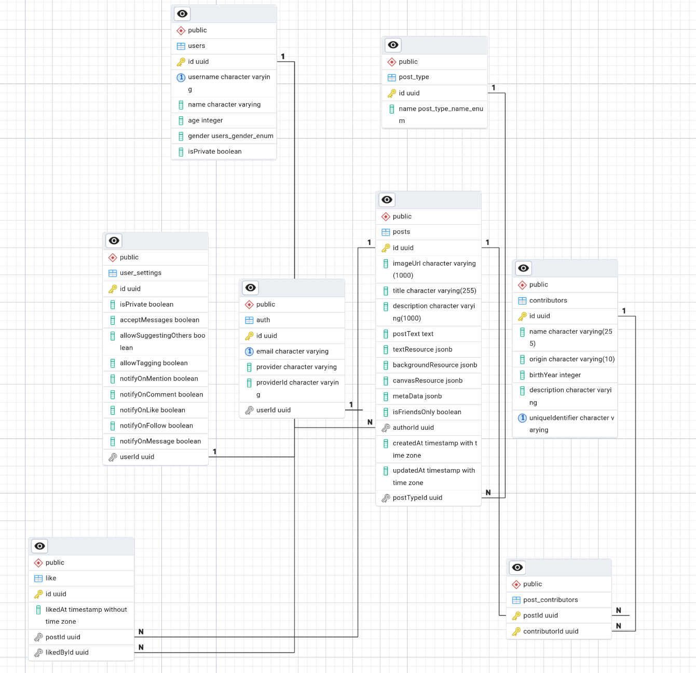

#  Architecture Decision Record (ADR) - Post Database ve API Modeli

## Post Database ve API Modeli
Postlar için veritabanında kullanılacak model:
 - Gerekli Post türlerini kapsamalı
 - Frontend için gerek ve yeter bir derecede veri sağlamalı
-  Kullancıların tercihleri ile rahatça vektörleştirilebilmeli ve aranabilmeli
- Kullanıcıların tercihlerine göre filtrelenebilmeli
- Gereğinden fazla veri içermemeli
- Gereğinden az veri içermemeli
ve 
Post API'si :
-  Kullanıcıların postları aramasına olanak tanımalı
- Kullanıcıların postları filtrelemesine olanak tanımalı
- İstemcinin arkadaşları tarafından paylaşılan postları görmesine olanak tanımalı, ki bunlar gizli olacaklardır 
- Kullanıcıların kendi postlarını görmesine olanak tanımalı
-  Frontend'in tek bir sorgu ile post yaratabilmesine olanak tanımalı
- Olası hataları mümkün olan en önce bir yerde yakalayabilmeli

Tüm bu gereksinimlerin ve henüz hesap edilememiş bir çok gereksinimin karşılanması elbette hatrı sayılır bir zaman alacaktır. Bu yüzden bu ADR' sık sık değişecek ve güncellenecektir. Ancak bu aşamada database:



ve API: 
 ```graphql
type Mutation {
  .
  .
  createPost(input: CreatePostInput!): Post!
  .
  .
}
input CreatePostInput {
  image: String!
  title: String!
  description: String
  postText: String!
  textInformation: TextResourceInput
  backgroundInformation: BackgroundResourceInput
  authorId: String!
  isFriendsOnly: Boolean
  metaData: [MetaDataInput!] = []
}
```

`image` alanı şuanda zorunlu ve Base64 formatında bir string beklemekte
```js
const BASE64_REGEX = /^data:image\/(jpeg|png|webp);base64,([A-Za-z0-9+/=])+$/;
const MAX_BASE64_SIZE = 10 * 1024 * 1024;

const validateBase64Image = (base64: string) => {
  if (!BASE64_REGEX.test(base64)) {
    return false;
  }

  const base64Data = base64.replace(/^data:.*?;base64,/, '');
  const buffer = Buffer.from(base64Data, 'base64');

  if (buffer.length > MAX_BASE64_SIZE) {
    return false;
  }

  return true;
};
```
 > image zorunlu olmayabilir?

`Image` string base64 alınıp

```js

 const { image, ...postData } = createPostDto;

      const { buffer, contentType } = await this.processImage(image);
      const fileExtension = contentType.split('/')[1];
      const key = `posts/${userId}/${randomUUID()}.${fileExtension}`;

      const { publicUrl } = await this.bucketService.uploadFile(
        key,
        buffer,
        contentType,
      );
```
işlendikten sonra Object Storage'da tutulur. 

`textInformation` ve `backgroundInformation` alanları, kullanıcının postu oluştururken eklemek istediği metin ve arka plan bilgilerini temsil eder. Bu alanlar isteğe bağlıdır ve kullanıcının tercihlerine göre doldurulabilir. `metaData` ise postun içeriği hakkında ek bilgiler sağlayan bir dizi nesne içerir. Bu yapı, kullanıcıların postlarını daha iyi organize etmelerine ve arama işlemlerini kolaylaştırmalarına olanak tanır.


## Post İçerik ve Sahiplik


 - Postlar standart bir içerik yapısına sahip değil. Ancak database ve API iş bu düzeni sağlayacak kadar esnek olmalı.
 - Postlar iki tür bir sahipliği içerecek: postu oluşturan kullanıcı ve sanatçı, senarist, yazar, şarkıcı, yönetmen vb. Bu sahiplik türleri arasında bir ayrım yapılması gerekecek. 
    - Postlar, kullanıcıların arkadaşları tarafından paylaşılan içerikleri gizli ise dahi güvenli şekilde görmesine olanak tanımalıdır. Bu, kullanıcıların gizliliklerini korurken aynı zamanda sosyal etkileşimlerini artırır.

### Sahiplik (senarist,  yazar, şarkıcı, yönetmen vb.)

Burada bir `Y` yönetmen, sözgelimi, bir şarkı sahibi de ise sistem bu tür bir ilişkiyi dahi kavrayabilecek ve bu yönetmenin `X` filminden bir alıntı ile atılan post ve `Y` şarkısından alıntı ile atılan postun aynı `Y` kişisine ait olduğunu anlamalı ki bu daima `Y` kişisinin eserlerinden oluşan postlara ilgi duyan bir kullancının davranışını anlamak için bir veri noktası sunabilsin. Bu ilişki için tüm ***senarist, yönetmen, yazar vb kişilerine `Contributor` diyeceğiz ve tüm bir içeriklerin bir veya daha fazla contributor'ü olabileceğini varsayacağız. Bu durumda bir postun birden fazla contributor'ü olabilir ve bu contributor'ler arasında bir ilişki kurulabilir. Bu ilişki, postun içeriği ve türüne bağlı olarak değişebilir. Örneğin, bir film postu için yönetmen ve senarist
contributor'leri olabilirken, bir müzik postu için şarkıcı ve söz yazarı contributor'leri olabilir. Bu tür bir ilişki, kullanıcıların içerikleri daha iyi anlamalarına ve arama işlemlerini kolaylaştırmalarına olanak tanır.

Ancak bu tür bir ilişki için bir kişinin yalnız tek bir kez ve ancak tek bir kez var olan bir nesne olabilmesini sağlamak için bir özel `identifier` kullanmalıyız. Bu öyle olmalı ki bir kişinin en az özelliği o kişiyi diğer bir kişiler nesnesinden tam olarak ayırsın. Burada akla 
- İsim Soyisim
- Government ID
- E-posta
gibi kimi özellikler gelse de bu özelliklerin böylesi bir sistemde tutulması ulaşılabilmesi ne gerçekçi ne de sebepli. Bu yüzden sistem içersinde iki farklı kişinin aynı ülkede aynı gün ay yıl içersinde aynı isim soyisim ile doğmadığını varsayacağız. Bu ikiz kardeşler için aynı isim verildi ise ihlal olacaktır, ancak bu durum şuanlık göz ardı edilebilecek kadar nadir. Bu yüzden bu tür bir sistemde bir kişinin `identifier`ı şu şekilde tanımlanabilir:
```js
const identifier = `${firstName.toLowerCase()}_${lastName.toLowerCase()}_${country}_${dateOfBirth}`;
```
 > Bu bize bir post oluşumunda bizim tarafımızdan sağlanan bir data kullanma zorunluluğu getiriyor. Bunu şimdilik planlanmış bir özellik olarak bırakıyoruz. 

 ## Post Gizliliği

 Bir post eğer postu oluşturan kullanıcı tarafından gizli olarak işaretlenebilir -friends only- veya hesap gizli -friends only- olarak işaretlenebilir. Postun bir tekil gizliliği basit bir query ile çözülebilir:
 ```SQL
SELECT * FROM posts WHERE isFriendsOnly = false;
```
ancak kullancının gizli bir hesabı var ise ve bu kullanıcı bir post oluşturmuş ise bu postun gizliliği en yalın bir şekilde:
```js
async findAll(skip = 0, take = 10): Promise<Post[]> {
    return this.repository.find({
      skip,
      take,
      where: {
        isFriendsOnly: false,
        author: {
          isPrivate: false,
        },
      },
      order: { createdAt: 'DESC' },
      relations: ['author'],
    });
  }
  ```

**Planned Feature:**

> Post API bir kullanıcı için özel bir related posts oluşturup dönebilecek şekilde olmalıdır bu cache ve CDN ile de desteklenmelidir.