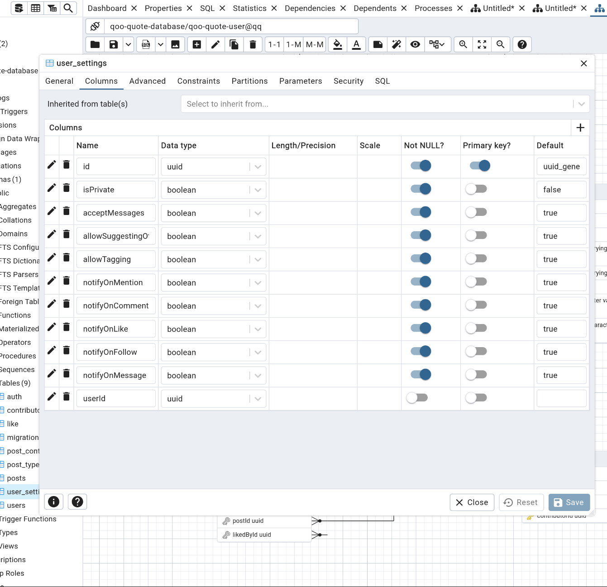

 # Architecture Decision Record (ADR) -  Kullanıcı Ayarları ve Tercihleri

 - Kullanıcı bir postuna dair neredeyse her şeyi ayarlayabilmeli kimlerin yorum yapabileceği, kimlerin beğenebileceği, kimlerin görebileceği gibi
- Kullanıcı bir postuna dair neredeyse her şeyi ayarlayabilmeli kimlerin öneri alabileceği, kimlerin öneri almayacağı gibi
- Kullanıcı bir postuna dair neredeyse her şeyi tercih edebilmeli örneğin kimseye önerilmemesi, kimseyle paylaşılmamasını vb
- Kullanıcı profiline dair neredeyse her şeyi ayarlayabilmeli kimlerin öneri alabileceği, kimlerin öneri almayacağı gibi
- Kullanıcı profiline dair neredeyse her şeyi ayarlayabilmeli kimlerin öneri alabileceği, kimlerin öneri almayacağı gibi
- Kullanıcı profiline dair neredeyse her şeyi tercih edebilmeli örneğin kimseye önerilmemesi, kimseyle paylaşılmamasını vb

## User Settings Entity 

> Bu entity, farklılaşacaktır.

## User Preferences 
- Kullancının davranışları ve kişiden bizzatihi alınan verilerle oluşturulacak bir modeldir.
- Kullancının tercihleri ve davaranışları daimi olarak güncellenmelidir.
- Kullanıcıların tercihleri ve davranışları, kullanıcıların etkileşimde bulunduğu içeriklerin türünü belirlemek için kullanılacaktır.

 > Şuanda bu modül geliştirilme aşamasındadır.
