# System Architecture

**This project is still in development and may change in the future. Be sure to check the latest version of the document.**

## Authentication

#### Creating a new user

Users can create a new account by providing their email and password.

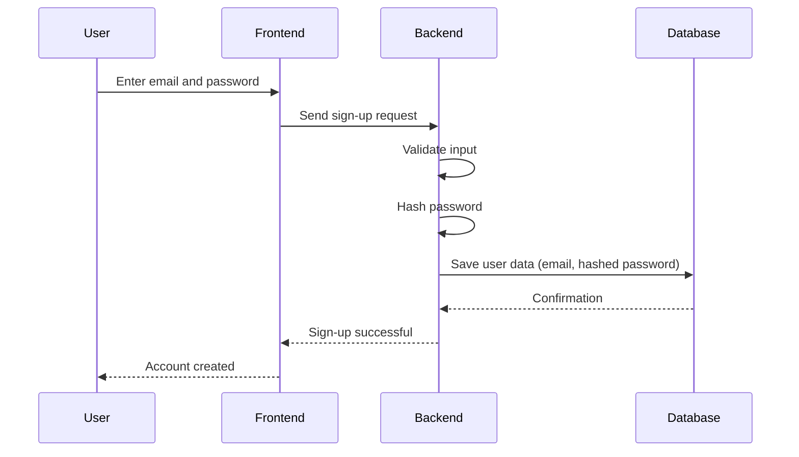

Users can also sign up using their Spotify or Pinterest account.

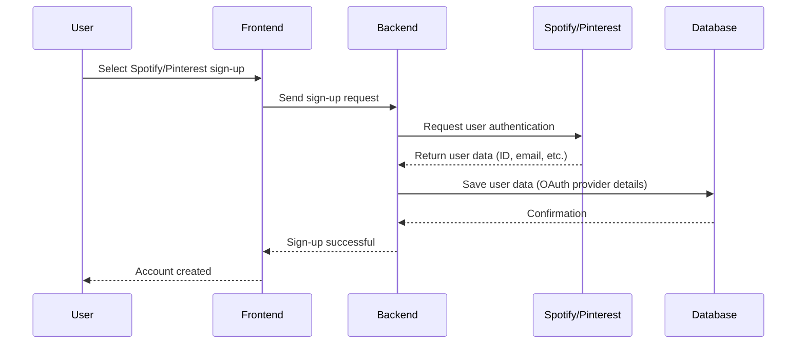

#### Logging in

At this point, we do not plan to use an external auth provider like Auth0, but we might consider it in the future. Either way, the architecture would remain the same, with the only difference being the external provider handling the authentication process.

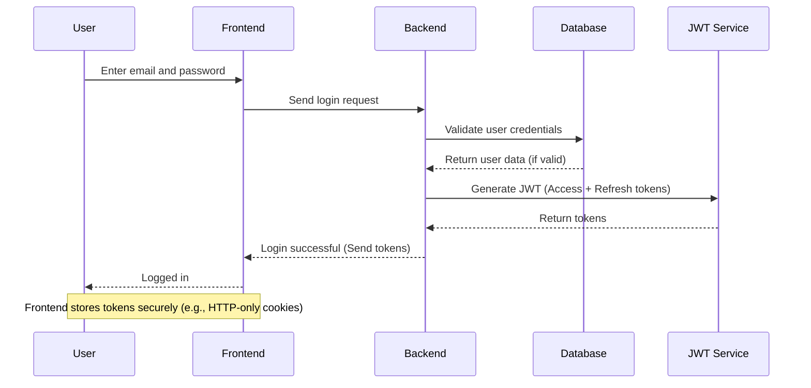

Nowadays, the most common way to handle authentication is by using JWT (JSON Web Tokens). This is a secure way to authenticate users and keep them logged in. The frontend stores the JWT tokens securely (e.g., in HTTP-only cookies) and sends them with every request to the backend. The backend then verifies the tokens and allows access to the requested resources if the tokens are valid. It is common to make users log in again after a certain period of inactivity, or when the access token expires. In this case, the frontend can use the refresh token to get a new access token without the user having to log in again.

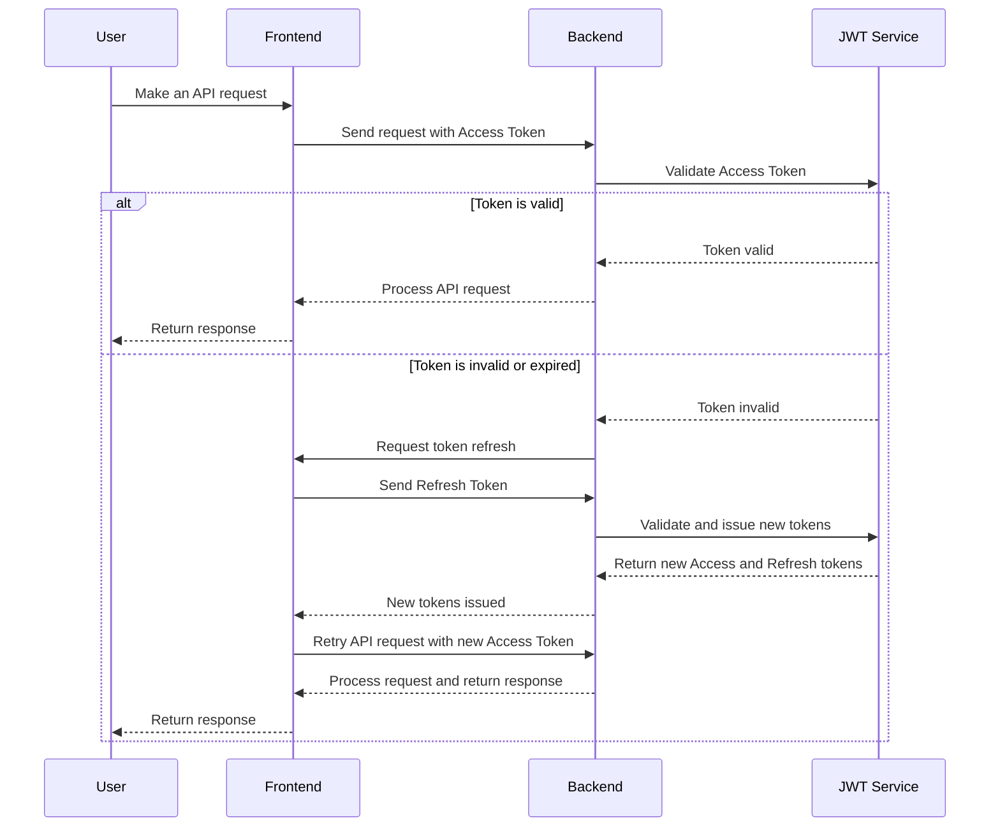
## Posts 

### Creating a new post

Users can create new posts. They can add a title, description, and tags to their post. They can also add images and videos to their post.

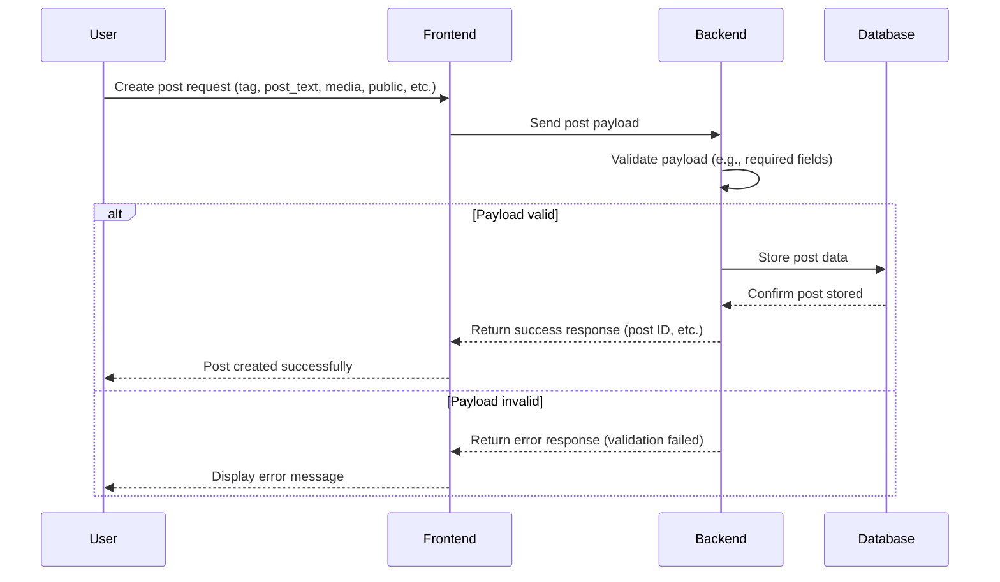

### Reposting

Users can repost content they find interesting, similar to retweeting.

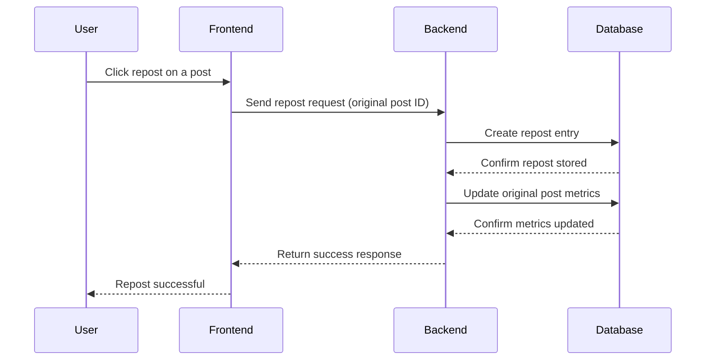

### Deleting a post

Users can delete their own posts.

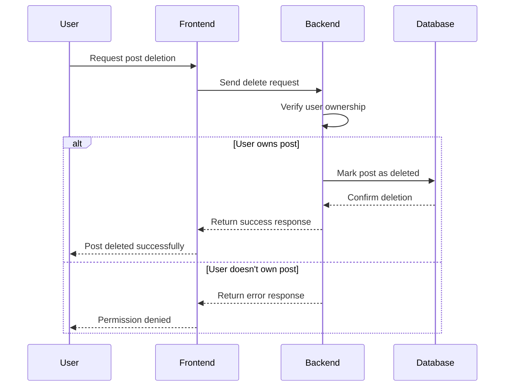

### Archiving a post

Users can archive posts to hide them from their public profile while keeping them for personal reference.

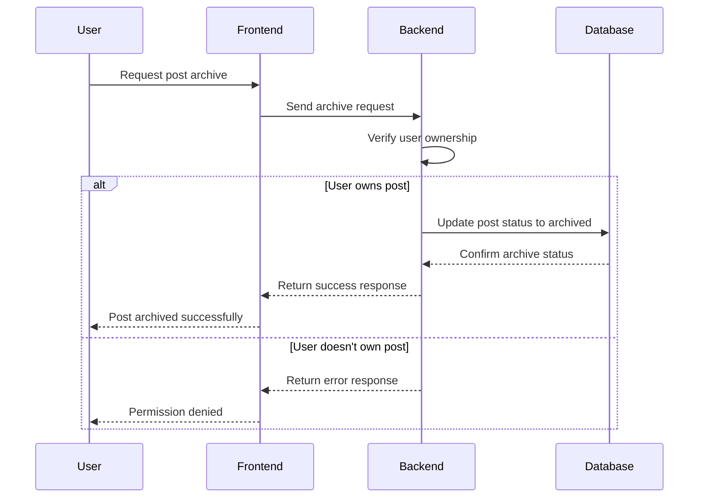

## Feed

The core of an app like QooQuote is the feed. This is where users can see posts from other users. The feed can be filtered by tags, and users can like and comment on posts. The feed is a complex system that requires a lot of work to get right. We are planning to use a *cumulative filtering* system to show the posts to the user. This means that we will filter the posts by tags, and then by the user's preferences. This way, the user will see the most relevant posts first.

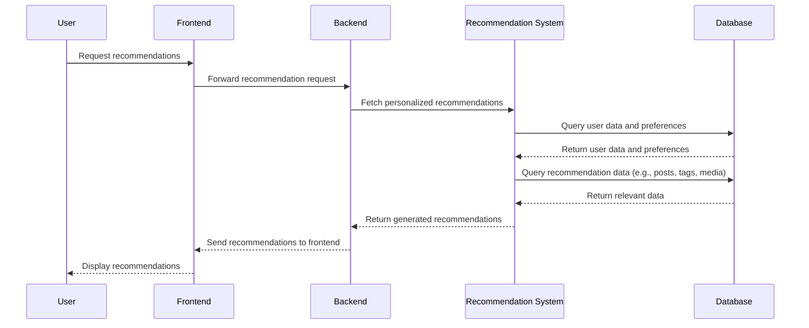

### The Algorithm

The recommendation system is the core of the feed. It is responsible for generating personalized recommendations for each user. The system uses a combination of collaborative filtering and content-based filtering to generate recommendations. Inspired by Twitter's recommendation system, we will use a hybrid approach to generate recommendations.

Since this system is too complex for a short period of time, we will start with a simple recommendation system that will generate recommendations based on the user's preferences. We will use a simple collaborative filtering algorithm to generate recommendations using pg-vector.

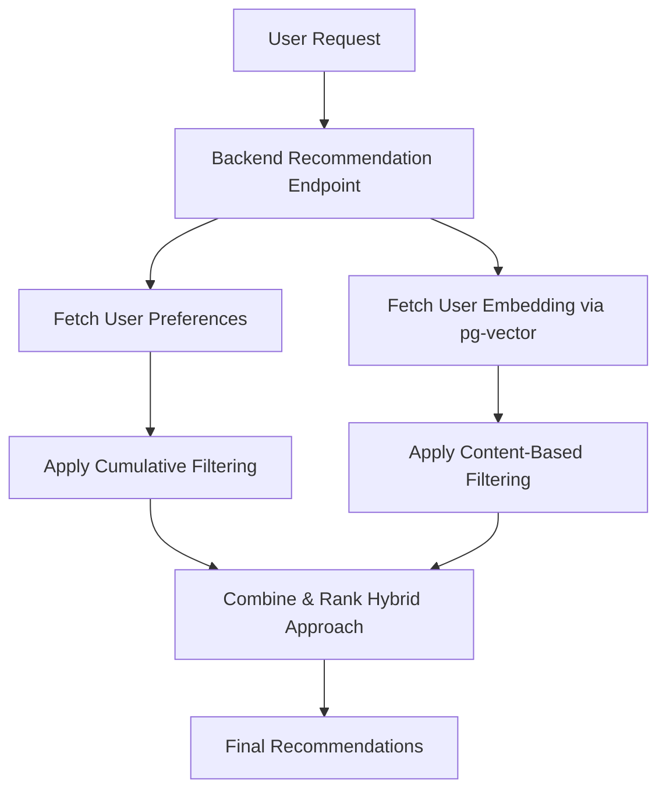
and the pg-vector flow looks like this

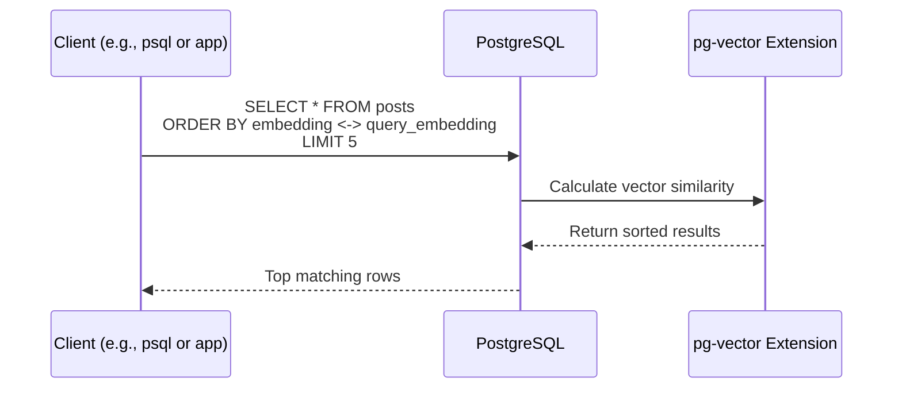

