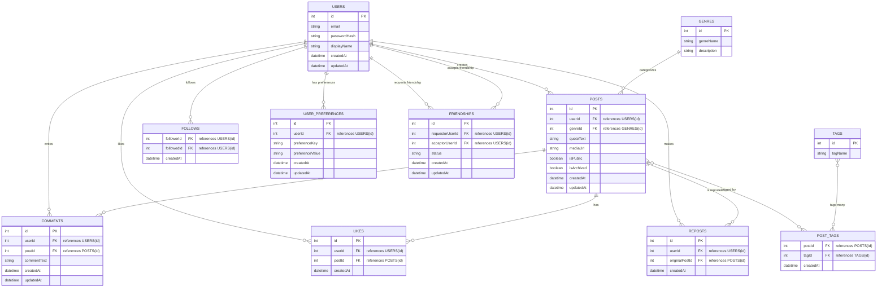

# Database Schema

**This project is still in development and may change in the future. Be sure to check the latest version of the document.**

```mermaid
erDiagram
    %% ------------------
    %%      USERS
    %% ------------------
    USERS {
        int       id PK
        string    email
        string    passwordHash
        string    displayName
        datetime  createdAt
        datetime  updatedAt
    }

    %% ------------------
    %%      POSTS
    %% ------------------
    POSTS {
        int       id PK
        int       userId FK "references USERS(id)"
        int       genreId FK "references GENRES(id)" 
        string    quoteText
        string    mediaUrl
        boolean   isPublic
        boolean   isArchived
        datetime  createdAt
        datetime  updatedAt
    }

    %% ------------------
    %%      GENRES
    %% ------------------
    GENRES {
        int       id PK
        string    genreName
        string    description
    }

    %% ------------------
    %%      TAGS
    %% ------------------
    TAGS {
        int       id PK
        string    tagName
    }

    %% ------------------
    %%      POST_TAGS
    %% ------------------
    POST_TAGS {
        int       postId FK "references POSTS(id)"
        int       tagId  FK "references TAGS(id)"
        %% optionally add a composite PK of (postId, tagId) 
        datetime  createdAt
    }

    %% ------------------
    %%      COMMENTS
    %% ------------------
    COMMENTS {
        int       id PK
        int       userId FK "references USERS(id)"
        int       postId FK "references POSTS(id)"
        string    commentText
        datetime  createdAt
        datetime  updatedAt
    }

    %% ------------------
    %%      LIKES
    %% ------------------
    LIKES {
        int       id PK
        int       userId FK "references USERS(id)"
        int       postId FK "references POSTS(id)"
        datetime  createdAt
    }

    %% ------------------
    %%      REPOSTS
    %% ------------------
    REPOSTS {
        int       id PK
        int       userId FK "references USERS(id)"
        int       originalPostId FK "references POSTS(id)"
        datetime  createdAt
    }

    %% ------------------
    %%      FOLLOWS
    %% ------------------
    FOLLOWS {
        int       followerId FK "references USERS(id)"
        int       followedId FK "references USERS(id)"
        datetime  createdAt
        %% Add a composite PK if desired (followerId, followedId)
    }

    %% ------------------
    %%  USER_PREFERENCES
    %% ------------------
    USER_PREFERENCES {
        int       id PK
        int       userId FK "references USERS(id)"
        string    preferenceKey
        string    preferenceValue
        datetime  createdAt
        datetime  updatedAt
    }

    %% ------------------
    %%    FRIENDSHIPS
    %% ------------------
    FRIENDSHIPS {
        int       id PK
        int       requestorUserId FK "references USERS(id)"
        int       acceptorUserId FK "references USERS(id)"
        string    status
        datetime  createdAt
        datetime  updatedAt
    }

    %% ------------------
    %%    RELATIONSHIPS
    %% ------------------

    %% 1 user can create many posts
    USERS ||--o{ POSTS : "creates"

    %% 1 user can have many comments; 1 comment belongs to 1 user
    USERS ||--o{ COMMENTS : "writes"

    %% 1 user can have many likes
    USERS ||--o{ LIKES : "likes"

    %% 1 user can make many reposts
    USERS ||--o{ REPOSTS : "makes"

    %% 1 post can have many comments; 1 comment belongs to 1 post
    POSTS ||--o{ COMMENTS : "has"

    %% 1 post can have many likes
    POSTS ||--o{ LIKES : "has"

    %% 1 post can be reposted many times
    POSTS ||--o{ REPOSTS : "is reposted"

    %% users follow many users (one-way)
    USERS ||--o{ FOLLOWS : "follows"

    %% 1 user can have many preferences
    USERS ||--o{ USER_PREFERENCES : "has preferences"

    %% FRIENDSHIPS: each row tracks requestor vs. acceptor
    USERS ||--o{ FRIENDSHIPS : "requests friendship"
    USERS ||--o{ FRIENDSHIPS : "accepts friendship"

    %% 1 GENRE can have many POSTS
    GENRES ||--o{ POSTS : "categorizes"

    %% many-to-many: POSTS & TAGS join through POST_TAGS
    POSTS }o--o{ POST_TAGS : "tagged by"
    TAGS }o--o{ POST_TAGS : "tags many"

```