# UML

**This project is still in development and may change in the future. Be sure to check the latest version of the document.**

## Class Diagrams

### Users

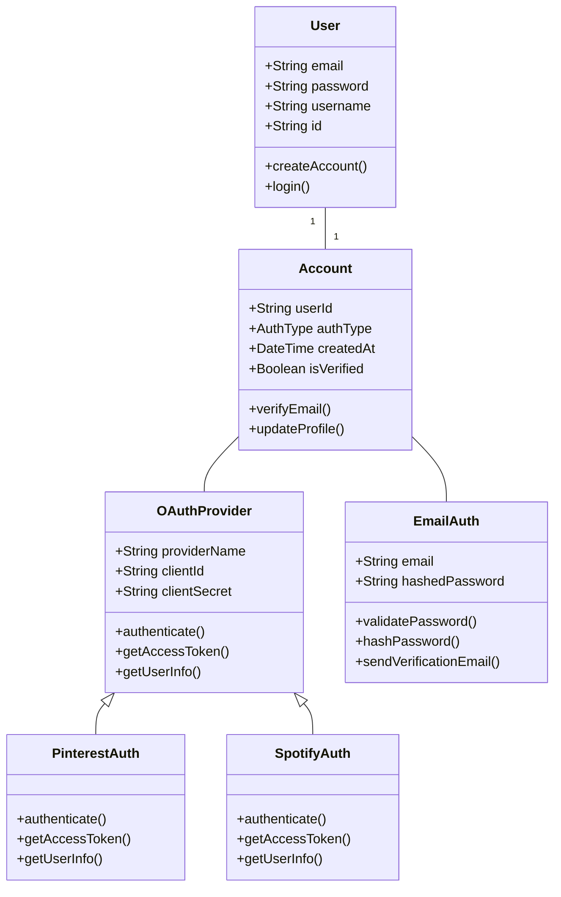

### Posts

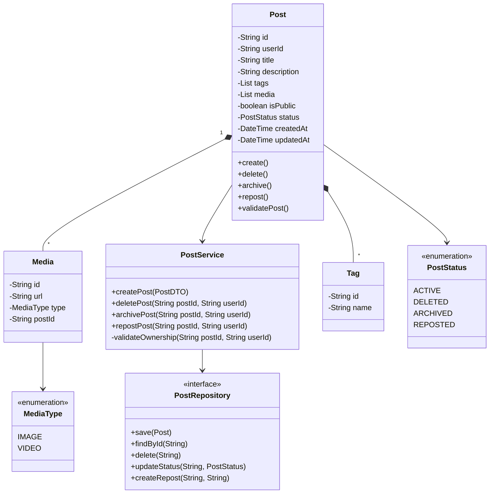

### Feed

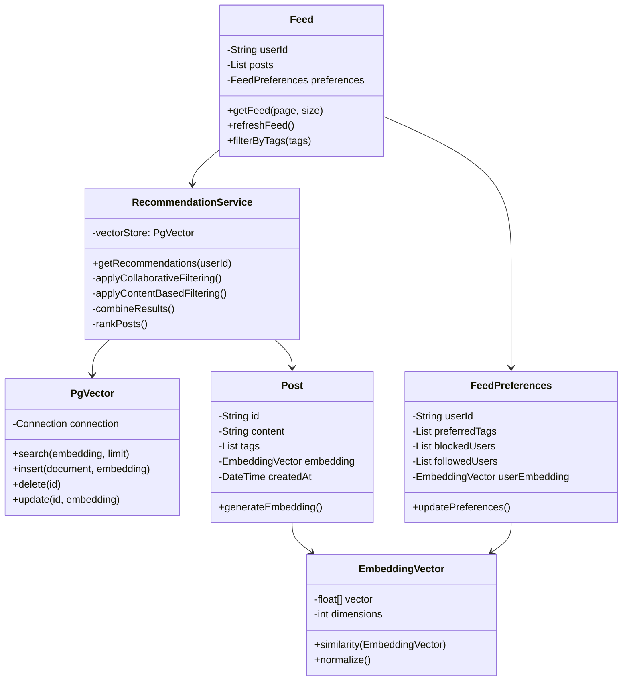
**SQL may look like this:**
```sql
CREATE EXTENSION IF NOT EXISTS vector;

CREATE TABLE feed_preferences (
    user_id UUID PRIMARY KEY,
    preferred_tags TEXT[],
    blocked_users UUID[],
    followed_users UUID[],
    user_embedding vector(384)
);

CREATE TABLE post_embeddings (
    post_id UUID PRIMARY KEY,
    embedding vector(384),
    FOREIGN KEY (post_id) REFERENCES posts(id)
);

CREATE INDEX post_embedding_idx ON post_embeddings 
USING ivfflat (embedding vector_cosine_ops)
WITH (lists = 100);
```

## Core Activity Diagrams

### Authentication Flow
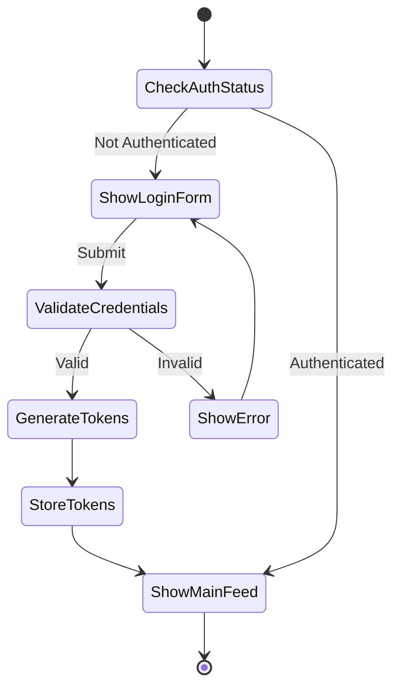
### Post Creation Flow
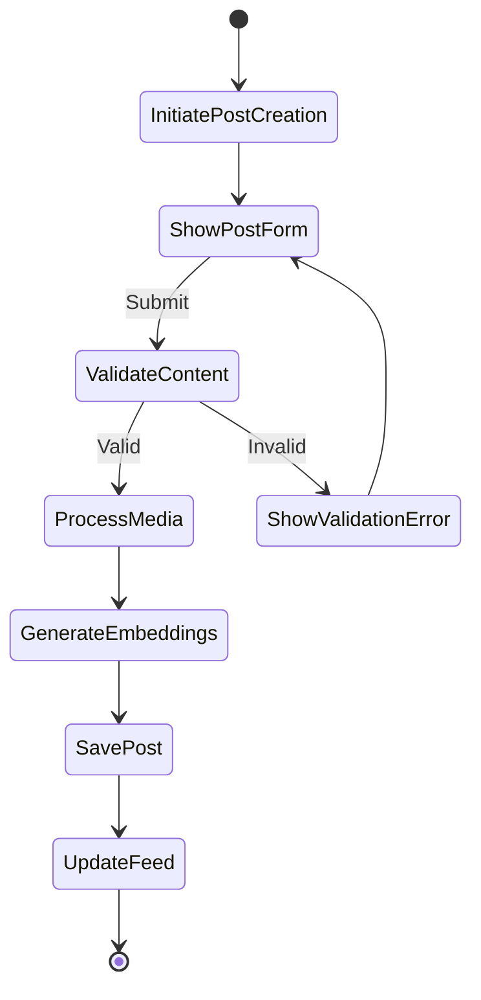
### Feed Generation Flow
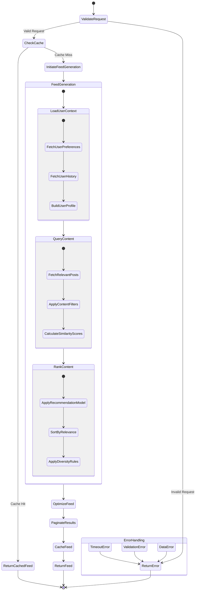
### User Interaction Flow

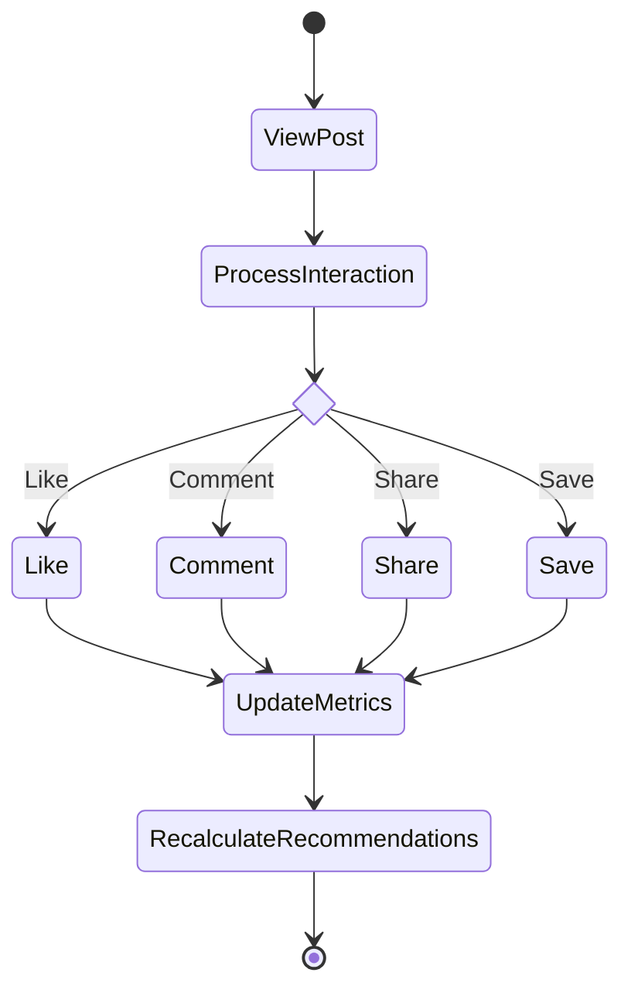
## Use Case Diagrams


 **Core Actors**
- **User**: Regular application user
- **Admin**: System administrator
- **System**: Automated processes


### Authentication System

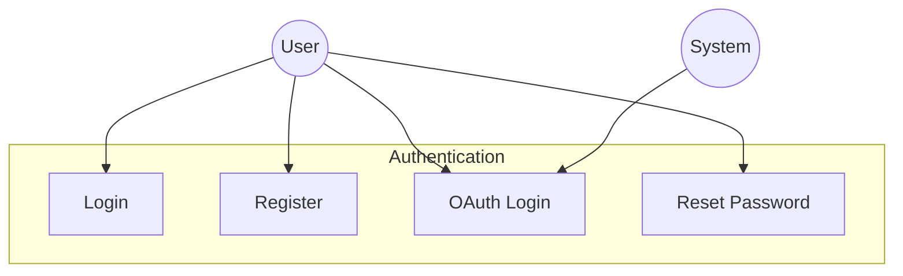
### Content Management

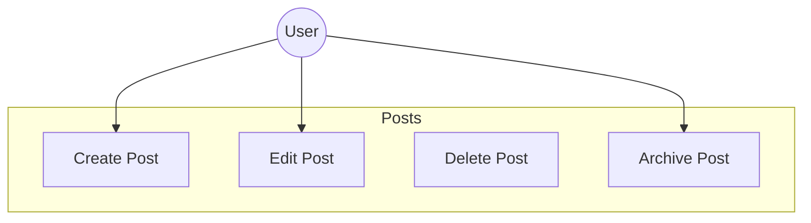

### Feed Generation

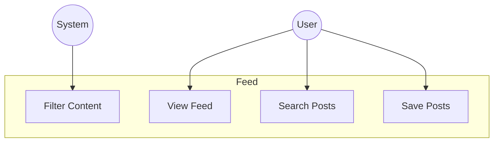

### Social Interactions

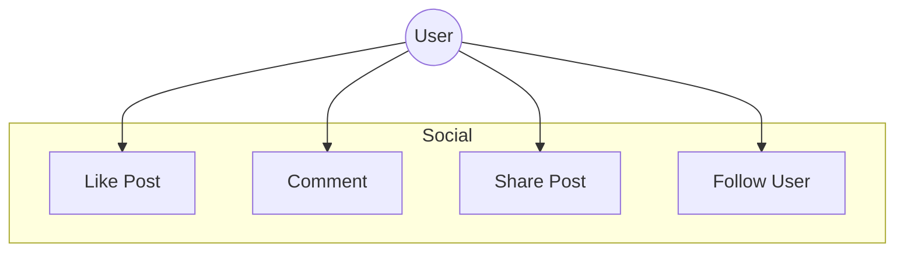
